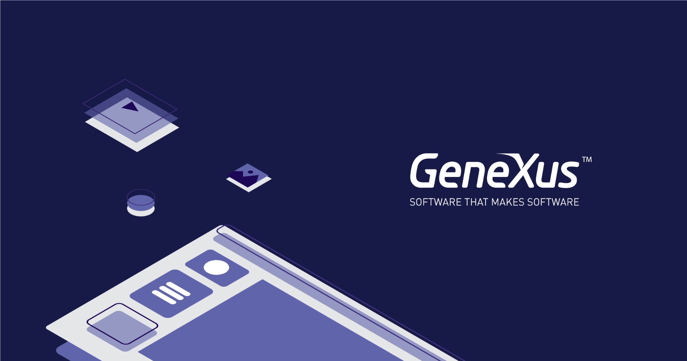

<h2 align="center"> Training GeneXus </h2>

  
  
    
    
  </a>
   </a>
    
   
  

  

  [Training GeneXus](https://training.genexus.com/en/)
<table align="center">
  <tr>
    <td align="center" style="padding=0;width=50%;">
      
    </td>
  </tr>
</table>

## Downloads

📦 [Install Genexus ](https://training.genexus.com/en/) Learn GeneXus  
📦 [Install SQL SERVER](https://www.microsoft.com/es-es/sql-server/sql-server-downloads)  

---

## Paypal Donation
🩸 Hacer una donación [PAYPAL](https://www.paypal.com/donate?hosted_button_id=98U3T62494H9Y) 🍵

---

 <table align="center">
    <tr>
      <td colspan="3">A</td>
        <td>B</td>
      </tr>
      <tr>
        <td>C</td>
      <td colspan="2"></td>
        <td>E</td>
      </tr>
      <tr>
      <td colspan="3">F</td>
        <td>G</td>
    </tr>
</table>